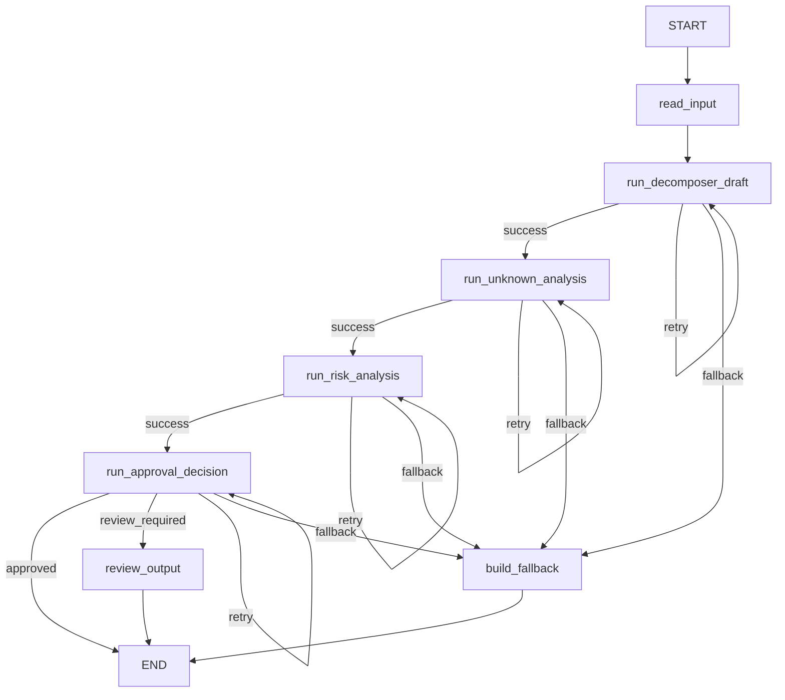

# Project 1 Task Decomposer Workflow

This note is the compact architecture view for the current `AI Task Decomposer` slice.

It exists for one reason: a reviewer should not need to reconstruct the workflow from Python files, test names, and eval artifacts.

## Current Workflow

## Why The Graph Exists

The graph is justified here because the workflow now has explicit control boundaries that would be clumsy and opaque in one model call:

- draft generation is separated from downstream control decisions;
- `unknowns` are produced by a dedicated tool path and affect approval behavior directly;
- `risks` are produced by a separate tool path and can also force guarded review;
- the approval step is an explicit policy boundary;
- retry and fallback behavior are visible workflow choices instead of hidden implementation accidents.

## Current Node Roles

- `read_input`
  - Reads the fixed markdown task prompt from `src/examples/input_backend_endpoint.md`.
- `run_decomposer_draft`
  - Produces the structured draft through the model-backed draft agent.
- `run_unknown_analysis`
  - Calls `analyze_task_unknowns` and writes tool-owned `unknowns` into state.
- `run_risk_analysis`
  - Calls `analyze_task_risks` and builds the final `TaskDecomposerResult`.
- `run_approval_decision`
  - Applies the review policy:
    - `review_required` when unknowns exist;
    - `review_required` when any risk is `high`;
    - `approved` otherwise.
- `review_output`
  - Produces the first deterministic review artifact for guarded outcomes.
- `build_fallback`
  - Produces a visible degraded end state after bounded retry failure.

## Minimal State Contract

The workflow stays narrow on purpose. The important state fields are:

- `prompt`
- `draft_response`
- `unknowns`
- `structured_response`
- `approval_status`
- `review_reason`
- `review_summary`
- `failure_reason`
- `retry_count`
- `used_fallback`
- `step_outcomes`

The point is not to store everything. The point is to store only what later routing or reporting actually needs.

## What The Eval Surface Proves

The current deterministic eval surface proves:

- compiled-graph routing still reaches stable `approved` and `review_required` end states;
- approval decisions match dataset-provided unknown and risk signals;
- workflow step outcomes remain explicit across the graph;
- narrow output-quality checks stay stable.

Current artifact entry points:

- dataset: `src/agentic_learning/evals/data/task_decomposer_eval_dataset_v1.json`
- summary: `artifacts/evals/task_decomposer_eval_summary_v1.json`
- failure log: `artifacts/evals/task_decomposer_failure_log_v1.md`
- repo-facing eval note: `artifacts/evals/task_decomposer_eval_note_v1.md`

## What This Slice Still Does Not Prove

- live model draft quality under real prompt drift;
- real unknown/risk heuristic quality inside the eval harness;
- fallback behavior as part of the eval suite itself;
- trace quality, latency, cost, or long-running execution behavior.

## Current Design Limits

- input is still one fixed markdown file;
- there is no CLI-selected task source;
- tool coverage is still intentionally narrow;
- the workflow demonstrates control, not broad product scope.
