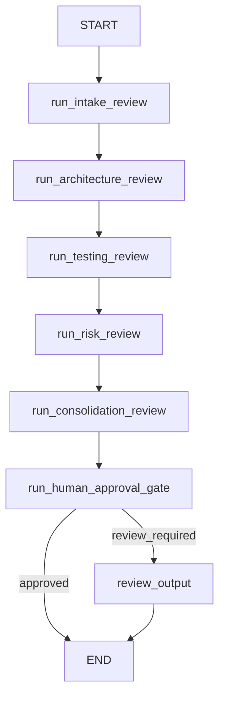

# Project 2 PR Review Workflow

This note is the compact architecture view for the current `PR Review Copilot Workflow` slice.

It exists for one reason: a reviewer should not need to reconstruct the workflow from Python files, test names, and demo output.

## Current Workflow

## Why The Graph Exists

The graph is justified here because the workflow now has explicit control boundaries that would be clumsy and opaque in one model call:

- intake owns PR classification and the initial trust boundary;
- architecture, testing, and risk are separate reviewer responsibilities instead of one generic review blob;
- consolidation aggregates reviewer outputs instead of letting each reviewer imply the final outcome independently;
- approval is an explicit policy boundary with a visible stop condition;
- the workflow now has a real guarded terminal state: `approved` or `review_required`.

This is still intentionally narrow. The graph exists to make the workflow legible and bounded, not to show off routing tricks.

## Current Node Roles

- `run_intake_review`
  - Reads the fixed sample PR input through the structured intake path and returns `PrReviewIntakeResult`.
- `run_architecture_review`
  - Produces a typed architecture-review artifact from the validated intake result.
- `run_testing_review`
  - Produces a typed testing-review artifact from the same validated intake result.
- `run_risk_review`
  - Produces a typed risk-review artifact from the same validated intake result.
- `run_consolidation_review`
  - Aggregates the three reviewer outputs into one typed `PrConsolidationResult`.
- `run_human_approval_gate`
  - Applies the first HITL policy boundary:
    - `review_required` when consolidation returns `high_risk`;
    - `review_required` when consolidation returns `review_needed`;
    - `review_required` when intake sets `needs_human_review=true`;
    - `approved` otherwise.
- `review_output`
  - Produces a short review-summary artifact for the human-review path.

## Minimal State Contract

The workflow stays narrow on purpose. The important state fields are:

- `intake_result`
- `architecture_result`
- `testing_result`
- `risk_result`
- `consolidation_result`
- `approval_status`
- `review_reason`
- `review_summary`
- `step_outcomes`

The point is not to create a state warehouse. The point is to keep only what later routing, policy, or reporting actually needs.

## Curated Live Trace Note

The repo now preserves one explicit live behavior note from the graph-level demo run on `2026-06-05`:

- command: `make demo-pr-review-graph`
- graph steps completed: intake, architecture, testing, risk, consolidation, approval
- final approval status: `review_required`
- generated review summary: the workflow stopped for human review because consolidation returned `review_needed`

Observed final recommendation from the live run:

> Document API contract with error codes and add validation/error-handling tests for edge cases.

The important proof is not the exact wording. The important proof is that the workflow reached the guarded review path through explicit policy instead of silently pretending the PR was clear.

## What This Slice Proves

The current Project 2 surface proves:

- one typed intake contract can feed multiple specialized reviewers;
- reviewer outputs can be consolidated into one typed aggregate artifact;
- approval is policy-driven, not prompt-vague;
- the graph reaches stable `approved` and `review_required` terminal states;
- the review-required path emits a visible human-facing artifact instead of stopping silently.

## What This Slice Still Does Not Prove

- dynamic routing or reviewer selection by change type;
- parallel reviewer execution;
- long-running pause/resume behavior;
- curated trace screenshots or trace URLs as repo artifacts;
- cost, latency, or production-scale reliability behavior.

## Current Design Limits

- input is still one fixed sample PR artifact;
- reviewers still run in one fixed sequence;
- the approval policy is intentionally narrow and local;
- the workflow demonstrates bounded orchestration, not broad product scope.
